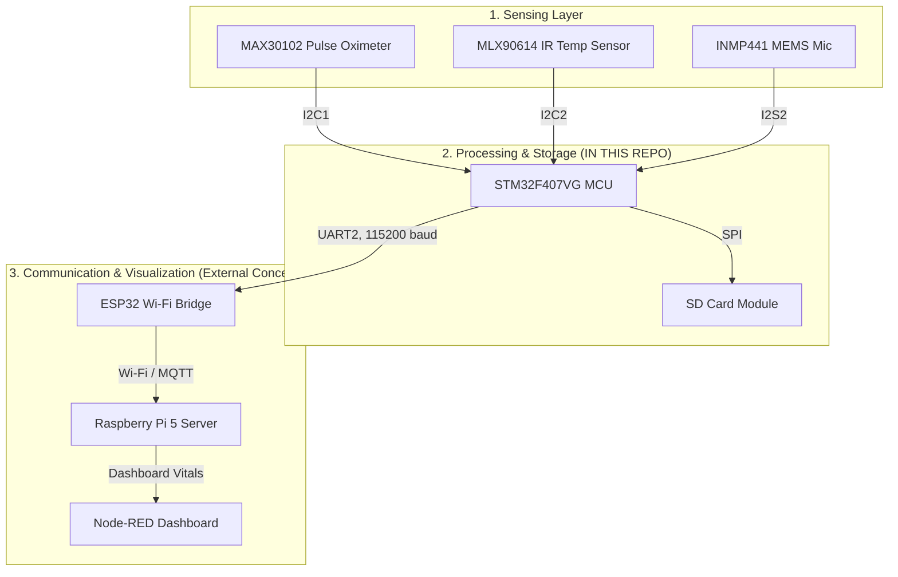
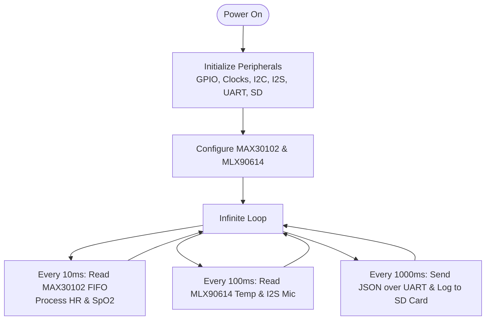
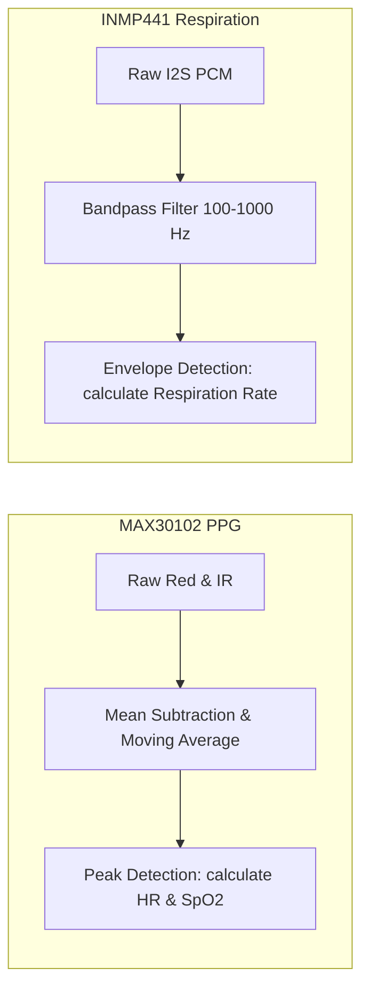
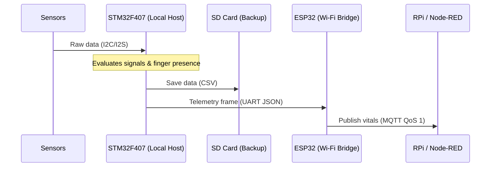

# Real-Time Patient Telemetry System for Ambulances

An IoT-based, low-latency vital signs monitoring system designed for emergency ambulances. This repository hosts the **STM32F407 C Firmware** (using the STM32 HAL), which functions as the central patient-side data acquisition and processing unit.

---

## 🌐 System Architecture

The system gathers physiological parameters (heart rate, oxygen saturation ($\text{SpO}_2$), non-contact body temperature, and respiratory activity) and transmits them in real time (average latency of **145 ms**) to a hospital-side dashboard.



---

## 🔄 Firmware Execution Flow

The firmware on the [STM32F407VG](file:///e:/Repos/ambulance-remote-telemetry/Core/Src/main.c) runs a non-blocking main loop, coordinating sensor checks, local SD card backups, and UART telemetry framing.



### Signal Processing Pipelines



---

## 📡 Data Flow & Protocol



### JSON Telemetry Packet format
When a patient's finger is detected and the vitals are valid, the STM32 sends the following JSON string over UART:
```json
{
  "heartRate": 76,
  "oxygen": 98,
  "temperature": 36.8,
  "micLevel": 1240,
  "timestamp": 124500,
  "status": "valid"
}
```
If the finger is not placed or stabilizing, the values default to `-999` with status `no_finger` or `stabilizing`.

---

## 📂 Repository Structure

This repository contains the STM32 source code:

```
ambulance-remote-telemetry/
├── Core/                            # Core firmware files
│   ├── Inc/                         # Include Headers
│   │   ├── max30102.h               # Low-level MAX30102 register definitions
│   │   ├── max30102_for_stm32_hal.h # STM32 HAL wrapper definitions for MAX30102
│   │   ├── maxim_algorithm.h        # PPG signal processing algorithm header
│   │   ├── mlx90614.h               # MLX90614 IR sensor driver header
│   │   ├── retarget.h               # printf UART redirector header
│   │   ├── gpio.h / i2c.h / i2s.h   # Peripheral configuration headers
│   │   └── main.h / usart.h         # System and USART headers
│   └── Src/                         # Source Implementations
│       ├── main.c                   # Scheduler, main loop and telemetry logic
│       ├── max30102.c               # Low-level MAX30102 driver
│       ├── max30102_for_stm32_hal.c # STM32 HAL implementation for MAX30102
│       ├── maxim_algorithm.c        # PPG signal processing algorithm implementation
│       ├── mlx90614.c               # MLX90614 sensor driver implementation
│       ├── retarget.c               # Redirects standard I/O (printf) to USART2
│       └── gpio.c / i2c.c / i2s.c   # Peripheral initialisations
├── Drivers/                         # STM32F4xx standard HAL & CMSIS Drivers
├── MPMC.ioc                         # STM32CubeMX configuration file
├── MPMC Debug.launch                # ST-Link debugger configuration parameters
├── .gitignore                       # Git exclusion settings
└── README.md                        # Project documentation (this file)
```

---

## ⚙️ Hardware & Connections

| Sensor | STM32 Pin | Interface | Function |
|:---|:---|:---|:---|
| **MAX30102** | `PB6` (SCL), `PB7` (SDA) | I2C1 | Heart rate & oxygen saturation ($\text{SpO}_2$) |
| **MLX90614** | `PB10` (SCL), `PB11` (SDA) | I2C2 | Non-contact infrared body temperature |
| **INMP441** | `PB12` (WS), `PB13` (CK), `PC3` (SD) | I2S2 | Digital MEMS microphone for respiration |
| **SD Card** | `PC8-12`, `PD2` | SDIO | Redundant local CSV logging (FAT32) |
| **ESP32 Bridge** | `PA2` (TX), `PA3` (RX) | USART2 | Serial telemetry output at 115200 baud |

---

## 🛠️ Build & Flash Instructions

1. Open **STM32CubeIDE**.
2. Go to **File ➡️ Import... ➡️ Existing Projects into Workspace** and select the directory root folder (`ambulance-remote-telemetry/`).
3. Build the project using `Ctrl+B` (produces `Debug/MPMC.elf`).
4. Connect your STM32F407 Discovery board via ST-Link.
5. Click the **Run** button to flash the MCU.
6. Connect a USB-to-UART converter to `PA2` (TX) at **115200 baud** to view JSON logs and vitals.

---

## 📊 System Performance & Cost

### Latency Breakdown
* **Sensor Conversion**: 10 ms
* **STM32 Processing**: 15 ms
* **JSON Packaging**: 5 ms
* **UART Serial Send**: 8 ms
* **MQTT & Wi-Fi Transmission (ESP32)**: 30–80 ms
* **Dashboard Update (Node-RED)**: 50 ms
* **Total Latency**: **120–180 ms** (Average: **145 ms**)

### Technical Validation
* **Packet Loss**: $< 1.0\%$ under standard Wi-Fi conditions.
* **Redundant SD Logging**: $100\%$ success rate.
* **Battery Life**: $> 24\text{ hours}$ using a standard 10,000 mAh power bank.
* **Total Cost**: **₹16,205** (a fraction of commercial units costing ₹8L–₹15L).

---

## ⚠️ Limitations & Mitigations

* **Vibrations / Motion Artifacts**: Handled via sample fluctuation checking in [main.c](file:///e:/Repos/ambulance-remote-telemetry/Core/Src/main.c). Changes $> 5,000$ in successive IR inputs temporarily flag data as `stabilizing`.
* **Light Interference**: Sunlight saturates the PPG sensor. Use an opaque 3D-printed finger cover to shield the MAX30102.
* **Acoustic Noise**: Sirens affect audio amplitude. Bandpass filters (100 Hz–1 kHz) are recommended to isolate breath signals.

---

## 👥 Contributors

Developed for the course **21ECC301P – Microprocessor, Microcontroller and Interfacing Techniques** (SRM Institute of Science and Technology):

* **Lenin Valentine C J** ([linkedin](https://www.linkedin.com/in/leninvalentine) | [github](https://github.com/LeninValentine06))
* **Arshad Ahmed B**
* **Harshith Kamal R**

**Advisor:** **Dr. Vasanthadev Suryakala S**, Department of ECE.
